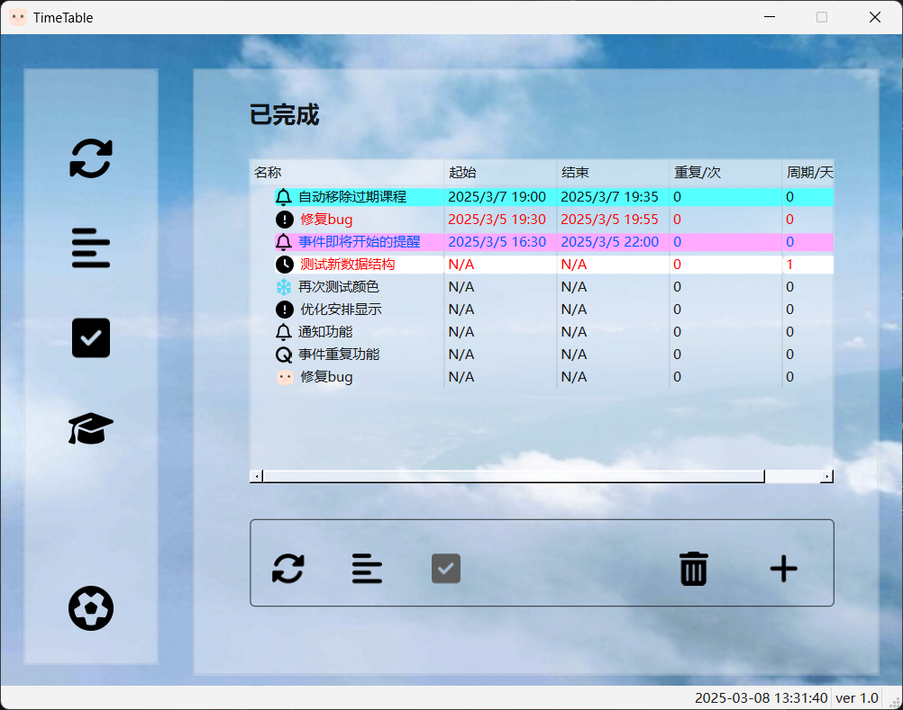
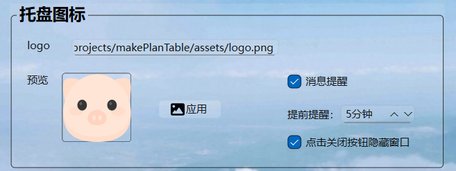
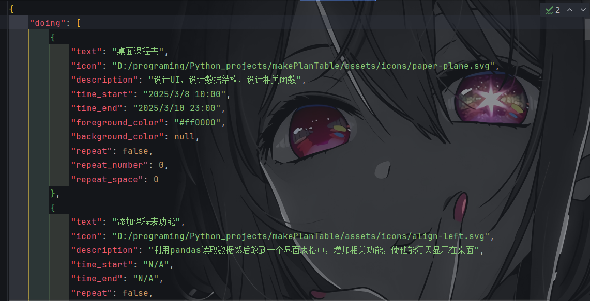

**Pig Fool Timetable**

# Description

English | [简体中文](assets/README_Ch.md)

An app which is used to manage your time.

It's an exercise work, so I can't guarantee the codes' quality.

Pig Fool(Inspired by _Zhu Bajie_, the Beloved pig Demon from _Journey to the West_ ). I know I am not good, but I will
continue my work.

Some codes in my project was generated by **DeepSeek**

# About

Written in [Python](https://www.python.org/)

Icons by [Font Awesome](https://github.com/FortAwesome/Font-Awesome)

UI by [PyQt6](https://www.riverbankcomputing.com/static/Docs/PyQt6/introduction.html#license)

[Logo ](https://www.aigei.com/item/zhu_tou.html)

### Download

Windows 11 installer

Windows 11 portable

or you can use code directly, and it's highly recommended to use virtual environment to run code.

### License

**[GPL](LICENSE.txt)**

- The table is generated by **DeepSeek**

| **Category**                      | **Rule Description**                                                                                                                                         |
|-----------------------------------|--------------------------------------------------------------------------------------------------------------------------------------------------------------|
| **License Type**                  | Strong Copyleft License (Projects using GPL-licensed code must be open-sourced)                                                                              |
| **Copyleft Strength**             | **Strong Copyleft**: If a project includes GPL-licensed code, the entire project must be open-sourced under the GPL and cannot be closed-source.             |
| **Closed-Source Allowed?**        | ❌ Prohibited. Modified code must be open-sourced.                                                                                                            |
| **Open-Source Requirements**      | Entire source code (including modifications) must be publicly available, and the open-source license must be GPL.                                            |
| **Commercial Use Allowed?**       | ✅**Allowed**: Commercial use (selling, distribution, or commercialization) is permitted, but GPL rules must be followed (source code must be provided).      |
| **Obligations for Modifications** | 1. Modified code must be open-sourced; 2. Original copyright notices must be retained; 3. Modifications must be clearly documented.                    |
| **Use Cases**                     | - Community-driven projects emphasizing code freedom (e.g., Linux kernel) - Prevents privatization and ensures users' freedom to modify and redistribute. |
| **Example Projects**              | Linux OS, GIMP Image Editor, WordPress (partial components)                                                                                                  |

---

### Features

- ✅ Add events and manage them.
- ✅ Notifying before the event starts. You can define it yourself.
- ✅ Local running and ❌ no server (I can't do that ).
- ✅ Event repeat support.
- ❌ Can't change event but in `json` file.

### Preview

# Please Note

⚠️ Please read **README** and **[LICENSE](LICENSE.txt)** carefully!

If you want to use the application, just download it on the Release.

If you want to use the code or something else, please respect my works and other open-source works.

If you have any questions, please make a feedback in Issue.

If you have any ideas, feel free to make a PR.

# Last

Thank you!

buy me a coffee:

